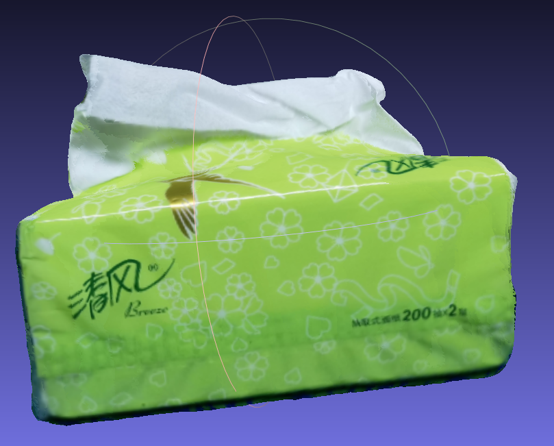

# Texture map

This repository contains vertex and uv texture map.

# Progress

- [x] vertex map

- [x] uv map
  - [x] Max Projection Area
  - [x] Graph Optimization
  - [x] 2022.03.27 Add mesh downsample by open3d to save memory and time
  - [x] 2022.03.27 Add pose uniform downsample to improve texture performance 
  - [ ] Color Adjustment
  - [ ] Photo-Consistency Check(occlude)

# Installation

- ```pip install -r requirements.txt ```

- ```git clone https://github.com/js-duan/texture_map.git```

# Data

- mesh(triangle)
- images
- poses (w2c)
- intrinsic

# RUN

## vertex texture map: Fast

- include ``min_depth``, ``best view``, ``mean view``, ``weight-mean view`` and ``optimization``(implement use open3d) vertex texture map

- ```python vertex_map_example.py --path PATH_TO_DATA --mesh NAME_OF_MESH [--depth PATH_TO_DEPTH] [--display]```

- if u don't have depth, the code will render depth use mesh

## uv map: Slow but performance is great

- include ``best view``, ``max projection area`` and ``graph optimization``(optim-algorithm implemented by [graph-optimzation](https://github.com/DIYer22/graph_optimization)) uv map

- ```python uv_map_example.py --path PATH_TO_DATA --mesh NAME_OF_MESH [--depth PATH_TO_DEPTH] [--display] [--label] [--downsample_pose] [--downsample_mesh] [--ratio 2]```

- use [--label] will save image label of each face in mesh

- use [--downsample_pose] to downsample texture images

- use [--downsample_mesh] [--ratio 2] will downsample mesh by ratio times 

# Examples

## original mesh

-  

## vertex map
- weight-mean
  
  

- optimization(open3d)

  

## uv map
- Max Projection Area(The same color in the right image indicates projection onto the same image)
  
   

- Graph-Opimization
  
   
